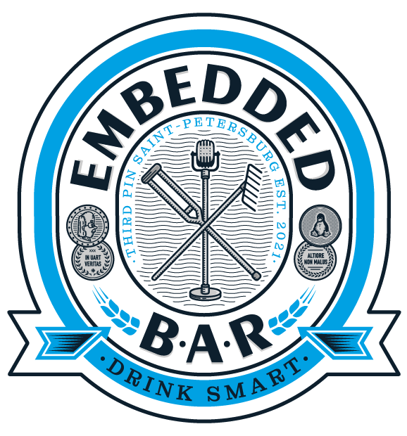

# Embedded bar

<figure markdown="span">
  { width="300" }
</figure>

Почему все современные митапы такие скучные?  
  
Потому что там нет пива!  
  
На время мероприятия наш офис (или любая другая площадка) превращается уютный бар, где можно зацепить пинту пива, послушать истории и пообщаться с коллегами из Embedded тусовки.

## Про что это мероприятие?

Если коротко - то про **общение**. Да, у нас есть доклады, где спикеры рассказывают классные истории и делятся полезными вещами, но самое интересное происходит между ними.  

## Как проходит стандартный Embedded bar?

### Знакомство и пиво

Мы собираемся, пьём пиво с пиццей, рассказываем о себе и делимся последними новостями и байками

### Доклады спикеров

Слушаем доклады участников, с перерывами на вопросы и обновление бокалов.

### Афтепати  

Обсуждение докладов, вечеринка.

Хоть это и бар, алкоголь не обязателен к употреблению, можно пить безалкогольный алкоголь или даже сок! 
Главное - атмосфера. 
Это место для непринуждённого общения, задушевных бесед с друзьями и коллегами до ночи.

## Где проходит Embedded bar
Ищи ближайшие локации и даты в разделе [Найти бар](locations.md). Чтобы не пропустить анонсы новых мероприятий - подписывайся на [Embedded bar канал в телеграме](https://t.me/embeddedbar). Хочется выступить - пиши организатору.

Если ближайший бар слишком далеко, возможно, пора организовать его самостоятельно!
Подробные инструкции в разделе [Инструкции](instructions/bar_passing.md), помимо этих материалов, другие организаторы всегда готовы помочь провести мероприятие.
