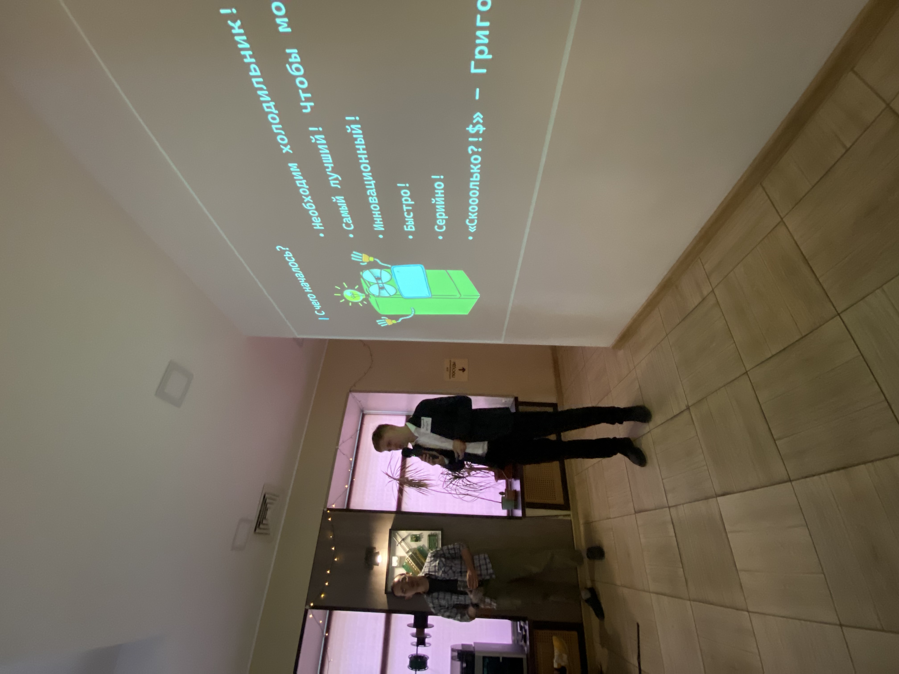
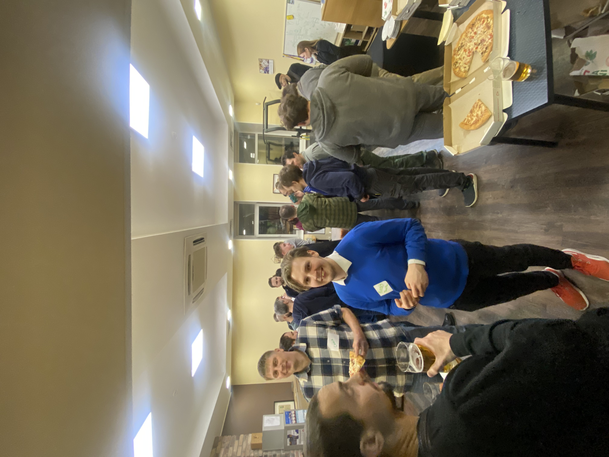
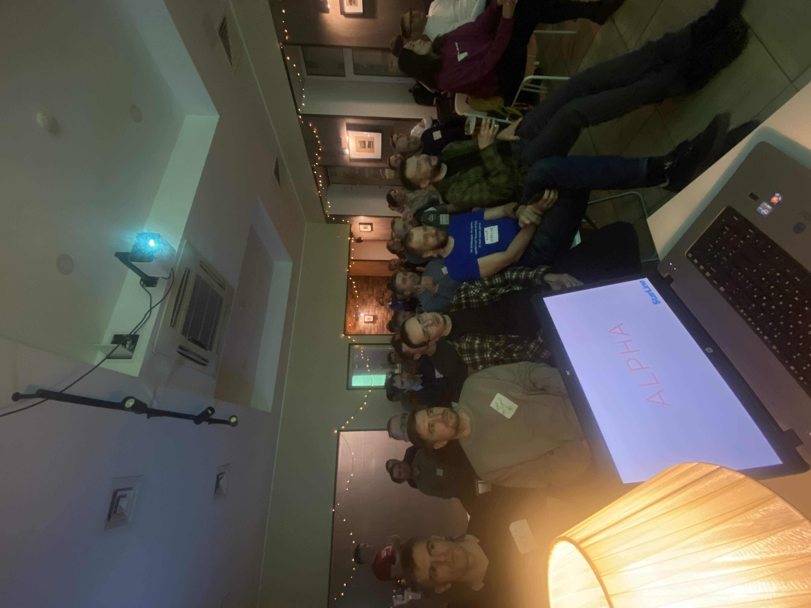
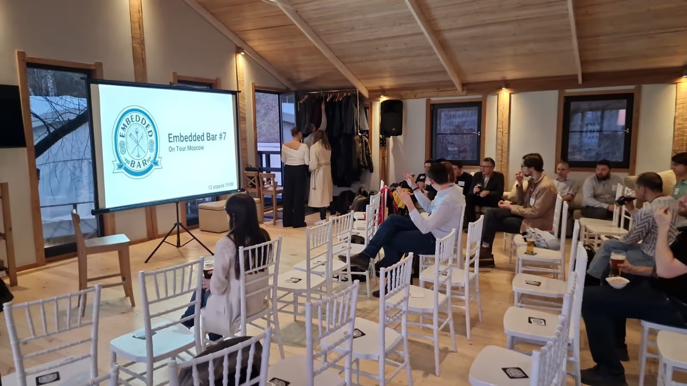
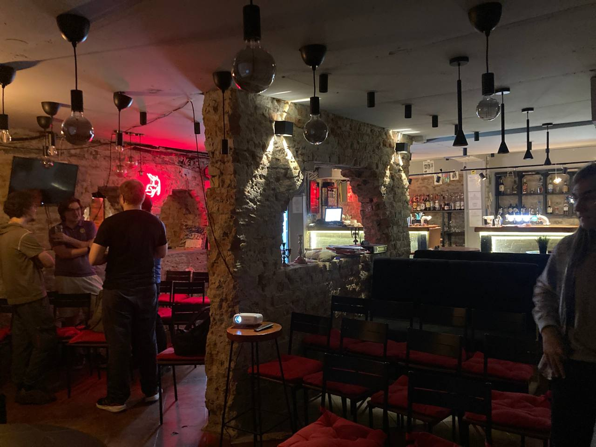
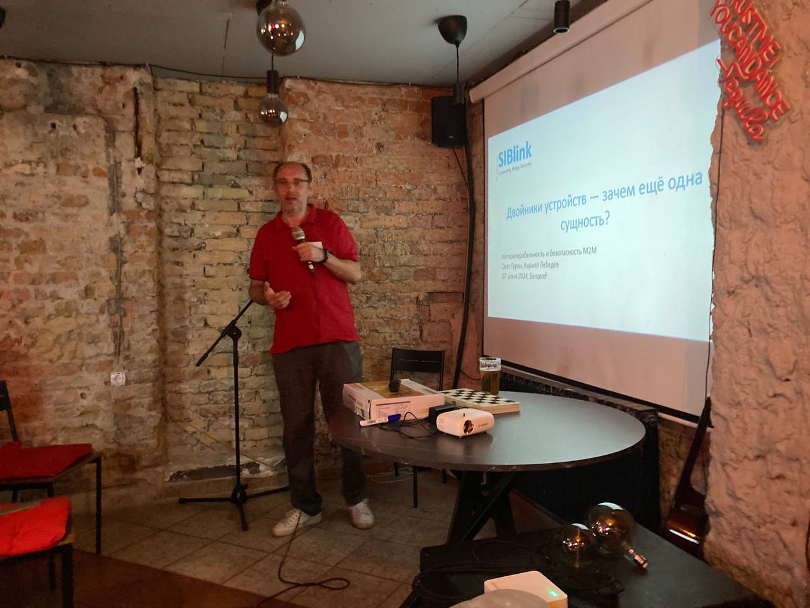

# Сводная таблица

| Город           | Название        | Пиво      | Стоимость | Площадь зала, м2 | Общая площадь, м2 | Вместимость, человек |
| --------------- | --------------- | --------- | --------- | ---------------- | ----------------- | -------------------- |
| Санкт-Петербург | Офис Третий пин | Кейтеринг | 0         | 51               | 133               | 50                   |
| Москва          | LOFT HOUSE      | бар       | 30000₽    | 90               | 130               | 45                   |
| Белград         | бар М10         | бар       | 0         | 61               | 100               | 40                   |

## Поиск помещения

Критерии: 

- Наличие Пива, желательно разливного (настоящий бар, кэйтеринг или бутылки, в порядке ухудшения)
- Вентиляция, кондиционеры
- Проектор или большой экран
- Стулья и место для их размещения
- Пространство для общения
- Звук, если народу больше 10 человек (2 микрофона и усилитель)
- Туалеты

### Примеры помещений

#### Санкт-Петербург, офис Третий пин

- Помещение для докладов 56м^2
- Помещение для общения и бара 52м^2
- Вспомогательные помещения 25м^2
- Вместимость - до 50 человек
- Стоимость - бесплатно, компания - организатор

Спикер:

Зона общения:

Зал для докладов:

#### Москва, LOFT HOUSE

- Лофт с панорамным видом на реку, рядом с Крокус экспо 
- 2 зала 90 и 40 кв.м  
- Собственная веранда
- Вместимость до 45 человек
- Можно шуметь 24 часа
- 1 кВатта звука
- Плазма, караоке, проектор
- Панорама на реку
- Система кондиционирования
- Стоимость 5000₽/час, минимум 6 часов (30000₽)

#### Белград, бар М10

- Помещение для докладов 41+20м^2
- Помещение для общения и бара 10,5+11м^2
- Вспомогательные помещения 16м^2
- Вместимость - до 40 человек
- Стоимость - бесплатно, бар продавал напитки и снеки

Вид от проектора: 

Спикер:

